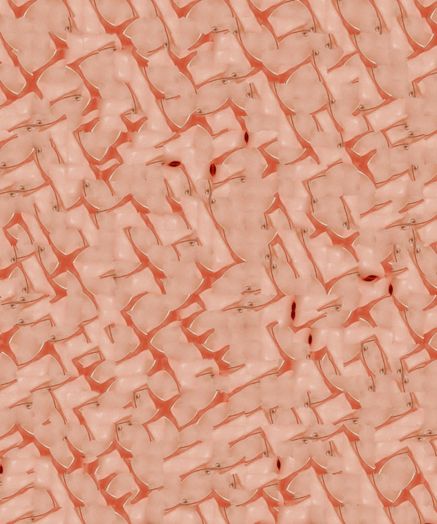

# eternal-face

## Overview

Collection of tools to generate artistically interesting distortions of facial image inputs. Renders human portraits and abstract patterns in synthesized, patch-based textures. Texture synthesis algorithm is implemented from [Efros & Freeman (2001)](https://people.eecs.berkeley.edu/~efros/research/quilting/quilting.pdf).

The full pipeline allows the user to take a facial image, deconstruct it into regions either equidistant or distinguished by feature points, and render the image in a synthesized texture based on these deconstructed regions. 

Individually there are also functions for facial averaging, facial warping, and texture synthesis/transfer for any source image.

## Examples

### Averages
Facial Average #1            |  Facial Average #2
:-------------------------:|:-------------------------:
 |  

### Texture Synthesis
Synthesized Texture #1            |  Synthesized Texture #2
:-------------------------:|:-------------------------:
 |  

### Texture Transfer
Transfer #1 - Larger Window Size           |  Transfer #2 - Smaller Window Size
:-------------------------:|:-------------------------:
 |  

Transfer #3 - Larger Window Size           |  Transfer #4 - Smaller Window Size
:-------------------------:|:-------------------------:
 |  

## Requirements
* python 2.7.14
* dlib 19.1
* imageio 2.4.1
* numpy 1.15.4
* opencv 2.4.13